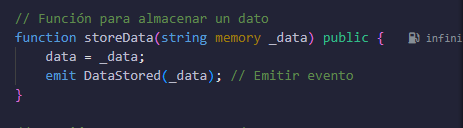
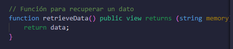
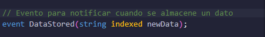
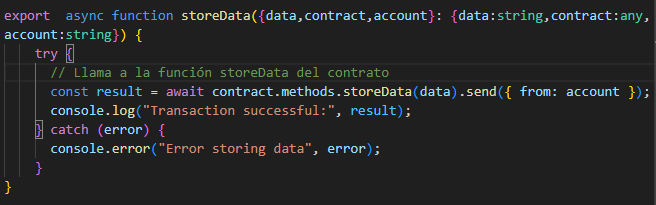
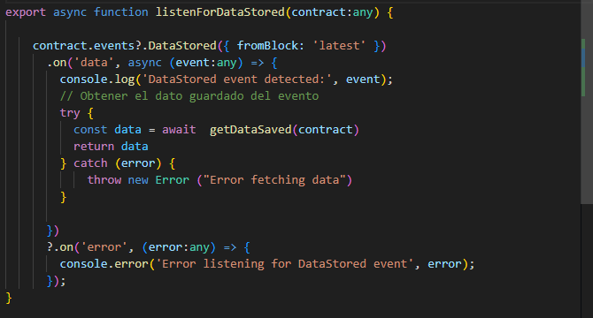
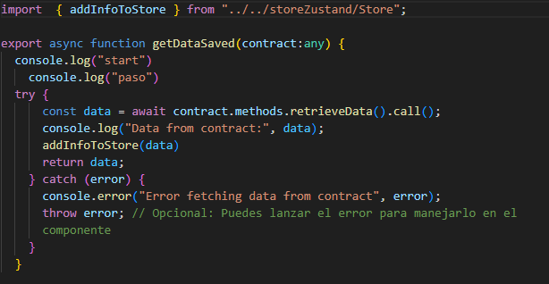
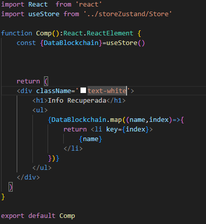

# ExtrimianChallenge

## Descripción general:

Esta app fue desarrollada para poder almacenar y recuperar datos en la blockchain con un smart contract compilado y deployado desde Remix.com
Dicho smart contract tiene la varias funciones tales como:

Almacenar un Dato

Recuperar el dato almacenado

Esta misma funcion se ejecuta cuando el siguiente evento es lanzado:

## Como se conecta el Front Con el SmartContract?

Esta conexión es realizada mediante web3.js
Dicha tecnologia permite interactuar entre redes blockchain para asi poder ejecutar smart contracts ( mediante un pequeño pago )

El dato a almacenar se obtiene desde el input el cual permite que el usuario coloque texto, el cual sera guardado y luego de ser procesado se ejecutara esta función:

Esta función lo que realiza es un llamado a la funcion de almacenamiento del smart contract.

Luego para recuperar el dato almacenado tenemos la funcion que escucha los cambios realizados en el smart Contract:

Esta funcion esta alerta de que se emitan eventos, luego de que un evento es emitido, esta tiene un llamado a otra función la cual obtiene de regreso el ultimo dato almacenado.

Esta función obtiene el ultimo dato almacenado y lo guarda en un array de textos, este array de textos es el estado global creado con zustand.

Luego en base a este estado global se renderizan sus Datos de forma individual

## Tecnologias utilizadas:
#### React: 
Utilizados para construir la interfaz de usuario y la aplicación móvil.
#### Zustand:
Manejo del estado global en la aplicación.
#### tailwind css: 
Estilización de componentes.
#### MetaMask SDK: 
Integración con MetaMask para manejar transacciones en la blockchain.
#### Solidity y Web3.js: 
Para interacción con contratos inteligentes en la blockchain.
#### JavaScript/TypeScript: 
Desarrollo de lógica de aplicación y scripts.
#### draw.io: 
Creación de diagramas y visualización de la arquitectura.
#### Alchemy:
Proveedor de Nodos.

## Bibliografia / Anexo:

Blog acerca de como conectar y utilizar funciones desde web3.js:
https://medium.com/@rajreetesh7/building-dapps-with-react-and-solidity-on-ethereum-881ca6bcd93e

Video acerca de como conectar web3.js con un smart contract:
https://www.youtube.com/watch?v=e4Fq4MWDKAs&t=829s

Video acerca de como desarrollar en solidity, deployar y como pagar con una testnet de metaMask:
https://www.youtube.com/watch?v=SAQ5Cvt_ePg&t=1476s

## Implementación:

Para poder clonar y desplegar el repositorio hay que realizar las siguientes acciones:
#### Clonar el repositorio
    git clone https://github.com/DylanEzequiel/ExtrimianChallenge.git
    cd ExtremianChallenge `
#### Instalar dependencias
    cd frontEnd
    npm install
    
#### Iniciar la app
     npm run dev 
#### Conectar metaMask
    verificar que google o su navegador tenga la extencion de metamask para luego poder iniciar sesion y unir la app con el smart contract y firmar las transacciones al momento de ejecutar distintos acciones
